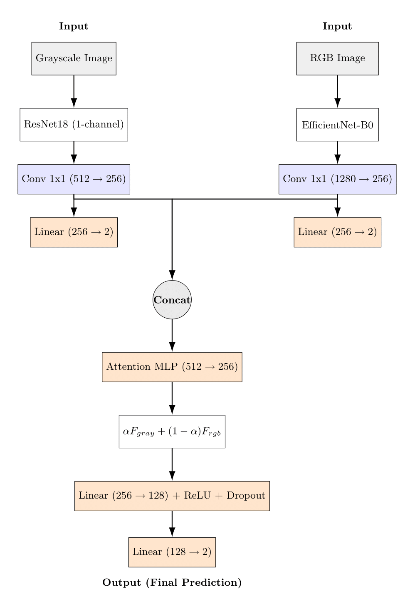
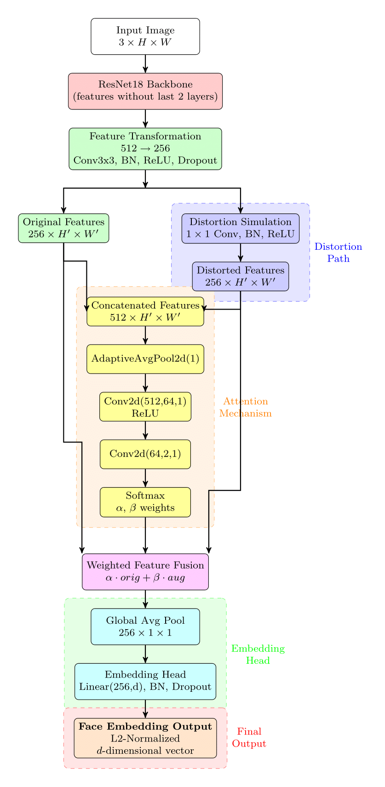

# Task A - Face Detection using AMR-CD Model

This repository contains the code and architecture for **Task A** of COMSYS Hackathon 5: **Face Detection** using a novel **AMR-CD (Attention-based Multi-Representation for Cross-Domain)** model. The system performs binary classification to determine if a given face belongs to a known identity, even under grayscale or color variations.

# Model Architecture




---

## 🧠 Model Architecture

The AMR-CD model is designed to handle multimodal visual inputs — RGB and grayscale — by combining their strengths through an attention-based fusion.

### ➤ Components:

- **Gray Branch**:  
  - Backbone: `ResNet18`  
  - Input: Grayscale image (1-channel)  
  - Output: 512D → Projected to 256D

- **RGB Branch**:  
  - Backbone: `EfficientNet-B0`  
  - Input: RGB image (3-channel)  
  - Output: 1280D → Projected to 256D

- **Auxiliary Heads**:  
  - One for each branch, used during training to guide each stream independently (via `aux_weight`)

- **Attention-based Fusion**:  
  - Learns a soft attention mask to blend the gray and RGB embeddings  
  - Final embedding: 256D fused representation

- **Classifier**:  
  - Fully connected layers with dropout  
  - Output: Binary label (0 or 1)

---

## 🔬 Methodology

### ✔ Motivation:
Faces may be captured in different modalities — grayscale from old/low-light sources, RGB from standard imaging. Instead of converting or discarding one domain, we fuse both for robust performance.

### ✔ Approach:
1. **Dual Encoders** learn modality-specific features.
2. **Attention Module** weighs which modality contributes more per sample.
3. **Auxiliary Supervision** boosts intermediate learning.
4. **Final Prediction** is made using the fused 256D representation.

---

Task A - Training & Evaluation Metrics

The table below summarizes the best training and validation results for the model used in Task A.

| Metric             | Training     | Validation    |
|--------------------|--------------|---------------|
| **Loss**           | 0.0444       | 0.2415        |
| **Accuracy**       | 0.9958       | 0.9621        |
| **Precision (P)**  | 0.9967       | 0.9659        |
| **Recall (R)**     | 0.9980       | 0.9842        |
| **F1 Score**       | 0.9974       | **0.9750**    |

> ✅ The validation F1 score of **0.9750** and Accuracy of **0.9621**
## ⚙️ Setup

Ensure Python ≥ 3.7 is installed.

### Install Requirements

```bash
cd Task_A
pip install -r requirements.txt 
```

Training
To train the AMR-CD model from scratch:

```bash
python main.py \
  --train_dir /path/to/train \
  --val_dir /path/to/val \
  --num_epochs 10 \
  --batch_size 32 \
  --learning_rate 1e-4 \
  --results_file results.csv
  ```

🔍 Inference
To run inference on the test dataset using a trained model:

```bash
cd Task_A
python TaskA_test.py \
  --model_path TASK_A_MODEL.pt \
  --test_dir /path/to/test \
  --batch_size 32 \
  --save_predictions \
  --output_file TaskA_test_results.csv
  ```

## This will:

Load the trained AMR-CD model

Evaluate the model on the test set

Print classification metrics (accuracy, precision, recall, F1)

Save per-image predictions to TaskA_test_results.csv

Save a summary of metrics to TaskA_test_results_summary.csv


# Task B - Face Matching

This repository contains the code and model architecture for **Task B** of the COMSYS Hackathon 5: **Face Matching**. The system is designed to verify whether two face images—one original and one potentially distorted—belong to the same identity, even under cross-domain conditions such as grayscale or low-quality distortions.

---

## 🧠 Model Architecture

The model employs a **dual-path ResNet-based embedding network** that fuses original and internally simulated distorted features via an **attention mechanism**. This allows the model to learn robust identity embeddings invariant to noise and domain shift.

<p align="center">
  
</p>

---
## 🧠 Architectural Details

The model for **Task B: Face Matching** leverages a dual-path architecture built on top of a **ResNet-18 backbone**, with a novel **attention-based fusion** mechanism. This design enables robust comparison between original and distorted facial images. Below are the key components:

- **Backbone:**
  - A pretrained **ResNet-18** is used as the feature extractor.
  - The final classification layers are removed to retain high-dimensional convolutional features.

- **Shallow Transform Paths:**
  - The ResNet features are passed through two parallel transformations:
    - **Original Path:** `Conv(3×3) → BatchNorm → ReLU → Dropout2D`
    - **Distortion Simulation Path:** `Conv(1×1) → BatchNorm → ReLU`

- **Attention-Based Fusion:**
  - The outputs from both transformation paths are stacked and fed to an **attention module**:
    - `AdaptiveAvgPool → Conv(1×1) → ReLU → Conv(1×1) → Softmax`
  - The attention mechanism produces weights `α` and `β` that dynamically fuse the feature maps:
  
    \[
    F_{\text{fused}} = \alpha \cdot F_{\text{orig}} + \beta \cdot F_{\text{aug}}
    \]

- **Projection Head:**
  - The fused features are **globally average pooled** and passed through:
    - `Linear → BatchNorm → Dropout`
  - The output is a **256-dimensional L2-normalized embedding vector**.

This architecture allows the model to adaptively emphasize useful components of the original and distorted features, enhancing robustness across varying input qualities.

## 🔍 Methodology

### 🔸 Feature Extractor
- Uses either **ResNet18** or **ResNet50** (configurable).
- Extracts spatial feature maps from the input image.

### 🔸 Distortion Simulation
- A 1x1 convolution simulates internal distortions on the extracted feature maps to mimic unseen perturbations during inference.

### 🔸 Attention-Based Fusion
- Original and distorted features are fused using a **learned attention mechanism**.
- Attention scores determine how much weight each view contributes.

### 🔸 Embedding Head
- Applies global average pooling and maps features to a low-dimensional **L2-normalized embedding**.
- Embeddings are optimized using a **Hybrid Loss** (contrastive + cosine).

### 🔸 Backbones Supported
- `ResNet18` for default `ResNet50` for alternative structure.
- A special `AlternativeFaceEmbedder` with **channel** and **spatial attention** layers for advanced robustness.


## 🧪 Inference Pipeline

The testing pipeline performs pairwise face matching and outputs a similarity score. It supports automatic backbone detection and fallback loading.

### 🧾 Output
Generates a CSV log with Accuracy, Precision, Recall,F1 and Macro F1-score for each tested model:

Training & Evaluation Metrics

The following table summarizes the best **training** and **validation** performance for both **distance-based** and **similarity-based** approaches during model development.

| Metric             | Training Distance-Based | Validation Distance-Based | Training Similarity-Based | Validation Similarity-Based |
|--------------------|--------------------------|----------------------------|-----------------------------|------------------------------|
| **Loss**           | 0.3118                   | 0.0403                     | 0.3118                      | 0.0409                       |
| **Accuracy**       | 0.9543                   | 0.9754                     | 0.9001                      | 0.9645                       |
| **Precision (P)**  | 0.9429                   | 0.9841                     | 0.8340                      | 0.9622                       |
| **Recall (R)**     | 0.9662                   | 0.9878                     | 0.9965                      | 0.9986                       |
| **F1 Score**       | 0.9544                   | **0.9860**                 | 0.9080                      | 0.9801                       |
| **Macro F1**       | 0.9543                   | **0.9432**                 | 0.8993                      | 0.9081                       |
| **AUC**            | 0.9884                   | 0.9884                     | 0.9884                      | 0.9884                       |

> ✅ Best validation F1 and Macro F1 scores are highlighted. Metrics were evaluated using cosine similarity and Euclidean distance at a threshold of 0.5.

## ⚙️ Setup

Ensure Python ≥ 3.7 is installed.

### Install Requirements

```bash
pip install -r requirements.txt 
```
Training
Set training paths in `config.py`:
```bash 
python
CONFIG = {
    'TRAIN_DIR': '/path/to/train',
    'VAL_DIR': '/path/to/val',
    ...
}
```

Run training:

```bash
  python train.py 
  ```

Model checkpoints will be saved in checkpoints/ and the best models in the paths specified by:

### taskB_best_similarity_model.pth

### taskB_best_distance_model.pth

Inference (Evaluation)
To evaluate on a test dataset:

```bash
cd Task_B
python TaskB_test.py \
    --test_dir /path/to/test/data 
```

## Notes
The system automatically detects and loads either the ResNet18-based model or the ResNet50-based variant at test time.

The attention-based fusion ensures robustness to distortions by dynamically weighting original and augmented paths.

The evaluation script uses cosine similarity by default for F1 computation.

